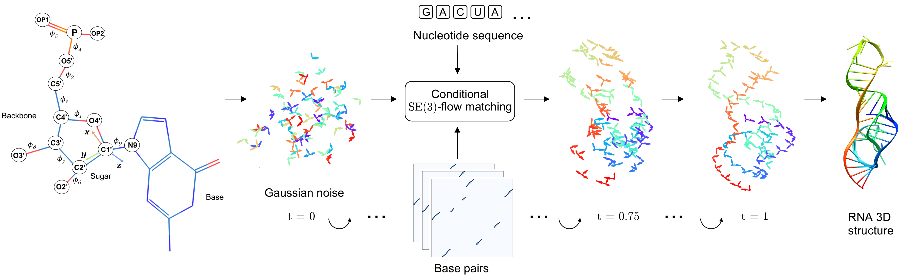

## RNAbpFlow: Base pair-augmented SE(3)-flow matching for conditional RNA 3D structure generation

by Sumit Tarafder and Debswapna Bhattacharya

[[bioRxiv](https://www.biorxiv.org/content/10.1101/2025.01.24.634669v1)] [[pdf](https://www.biorxiv.org/content/10.1101/2025.01.24.634669v1.full.pdf)]




## Installation

1. Use mamba to create a virtual environment and install dependencies for RNAbpFlow.

```
conda install -n base -c conda-forge mamba
mamba env create -f RNAbpFlow.yml
```

2. Activate the virtual environment

```
conda activate RNAbpFlow
```

Typical installation time on a "normal" desktop computer should take a few minutes in a 64-bit Linux system.

## Usage

Instructions for running RNAbpFlow:

1. Place your FASTA sequences and base pair maps in the Inputs folder (examples are provided).
2. Add a list of PDB IDs to list.txt inside the Inputs folder (an example is included).
3. Each line in list.txt contains a target ID with the number of sample structures to generate separated by space. If not specified, RNAbpFlow will use the default value specified in the configuration file in "configs" folder.
4. Download the trained checkpoints from [here](https://doi.org/10.5281/zenodo.14729510) and place the checkpoint folder in this repository.
- The default checkpoint configured is : RNA3DB.ckpt
- For CASP15 evaluation, edit the configs/inference.yaml to configure the "ckpt_path" field with checkpoint/CASP15.ckpt
5. Run this command to generate sample 3D structures.
   ```
   python3 inference.py
   ```

6. RNAbpFlow will generate 3D structures for each ID listed in "list.txt" and place them inside 'Prediction' folder.
-   Inference time to sample 10 RNA 3D structures for a typical RNA (~70 nucleotides) should take ~25 seconds on 1 GPU.
-   We have provided multi-GPU support for large scale sample generation, gpu usage can be configured in the configuration file (inference.yaml).

## Datasets

- For training and benchmarking we used the train-test split provided by RNA3DB available [here](https://github.com/marcellszi/rna3db). We downloaded the May 16, 2024 release.
- For sampling performance comparison with RNAJP, we downloaded their decoy set from [here](https://rna.physics.missouri.edu/RNAJP/index.html) and the corresponding native structures from [PDB](https://www.rcsb.org/).
- For CASP15 benchmarking, we collected the training set from [trRosettaRNA](https://yanglab.qd.sdu.edu.cn/trRosettaRNA/benchmark/).

