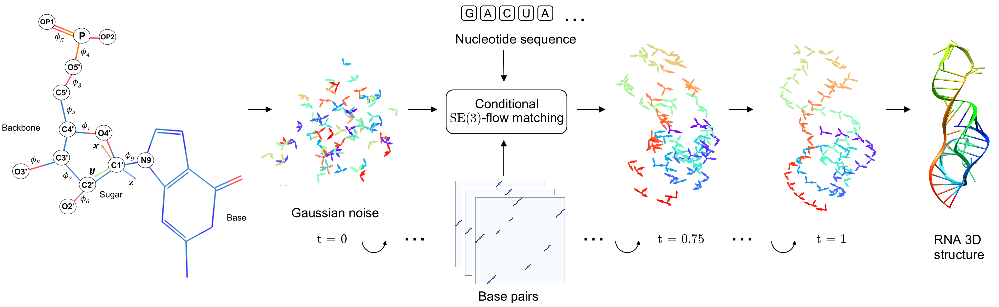

## RNAbpFlow: Base pair-augmented SE(3)-flow matching for conditional RNA 3D structure generation

by Sumit Tarafder and Debswapna Bhattacharya

published in [Nature Methods](https://doi.org/10.1038/s41592-026-03128-4)

Codebase for our base-pair-conditioned RNA 3D structure generation method, RNAbpFlow.

<a href="https://doi.org/10.5281/zenodo.19388910"></a>



## Installation

1. Use mamba to create a virtual environment and install dependencies for RNAbpFlow.

```
conda install -n base -c conda-forge mamba
mamba env create -f RNAbpFlow.yml
```

2. Activate the virtual environment

```
conda activate RNAbpFlow
```

Typical installation time on a "normal" desktop computer should take a few minutes in a 64-bit Linux system.

## Usage

Instructions for running RNAbpFlow:

1. Place your FASTA sequences and base pair maps (three) in the Inputs folder per target (examples are provided). Optionally, inference may be performed using a single base pair map (.npy) per sequence which will be replicated three times to match the required channel dimension.
2. Add a list of PDB IDs to list.txt inside the Inputs folder (an example is included).
3. Each line in list.txt contains a target ID with the number of sample structures to generate, separated by space. If not specified, RNAbpFlow will use the default value specified in the configuration file in the "configs" folder.
4. Download the trained checkpoints from [here](https://doi.org/10.5281/zenodo.18305861) and place the checkpoint folder in this repository.
- The default checkpoint configured is: RNA3DB.ckpt
- For CASP15 evaluation, edit the configs/inference.yaml to configure the "ckpt_path" field with checkpoint/CASP15.ckpt and checkpoint/CASP16.ckpt for CASP16 or prediction in general.
5. Run this command to generate sample 3D structures.
   ```
   python3 inference.py
   ```

6. RNAbpFlow will generate 3D structures in the specified format ("pdb", "mmcif/PDBx" or both) for each ID listed in "list.txt" and place them inside the 'Prediction' folder.
-   Inference time to sample 10 RNA 3D structures for a typical RNA (~70 nucleotides) should take ~25 seconds on 1 GPU.
-   We have provided multi-GPU support for large-scale sample generation. GPU usage can be configured in the configuration file (inference.yaml).

## Datasets

- List of targets used in training and benchmarking are available [here](https://doi.org/10.5281/zenodo.18305861).
- For training and benchmarking, we used the train-test split provided by RNA3DB available [here](https://github.com/marcellszi/rna3db). We downloadeded the 2024-04-26 RNA3DB release.
- For sampling performance comparison with RNAJP, we downloaded their decoy set from [here](https://rna.physics.missouri.edu/RNAJP/index.html) and the corresponding native structures from [PDB](https://www.rcsb.org/).
- For CASP16 blind benchmarking, we used the entire RNA3DB dataset available [here](https://github.com/marcellszi/rna3db). We downloaded the same 2024-04-26 RNA3DB release. For training data augmentation via cross-distillation, we downloaded the bpRNA-1m (90) dataset from [here](https://bprna.cgrb.oregonstate.edu/download.php#bpRNA-1m(90)).
- For CASP15 blind benchmarking, we filtered the RNA3DB release to collect all the chains released in PDB before 2022-04-26.
